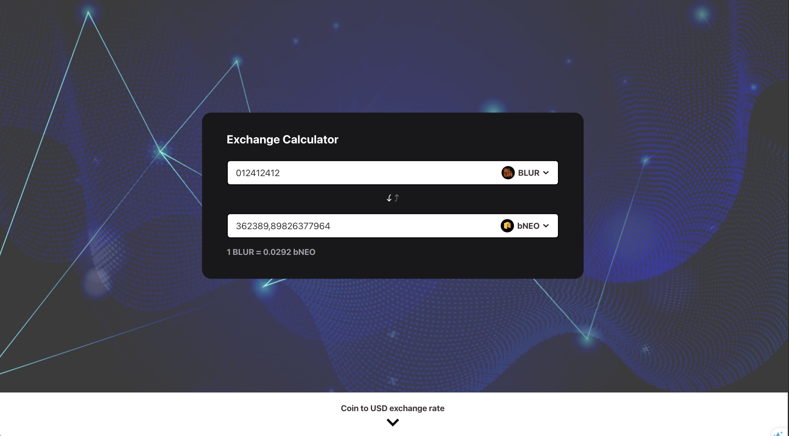
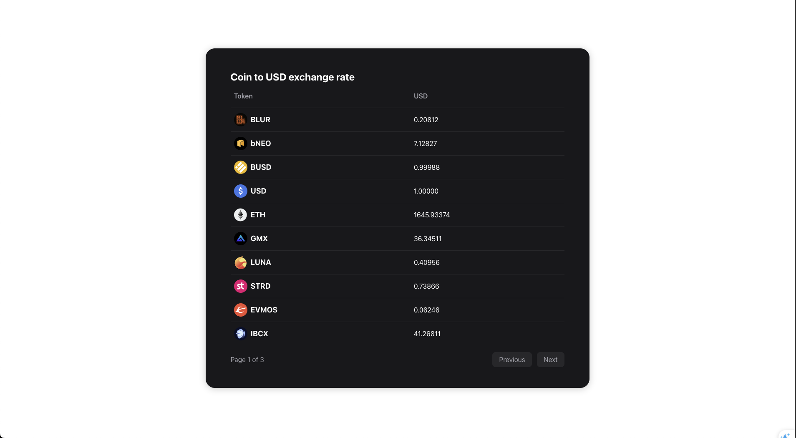

## Summary
- This is my own solution for 99Tech Frontend coding challenge
- Challenge can be found [here](https://s5tech.notion.site/Code-Challenge-05cdb9e0d1ce432a843f763b5d5f7497?p=6052097f0f144200bbea7c2fa75c0124&pm=s)

## How to run
Open CMD or Terminal. Nodejs is required
- Problem 1: `yarn problem_1` -> It will ask for `N` value. Type it then it will give you result back
- Problem 2: 
  - `cd ./src/problem2 && yarn` 
  - `yarn dev`
  - Open browser at url [http://localhost:5173/](http://localhost:5173/)

